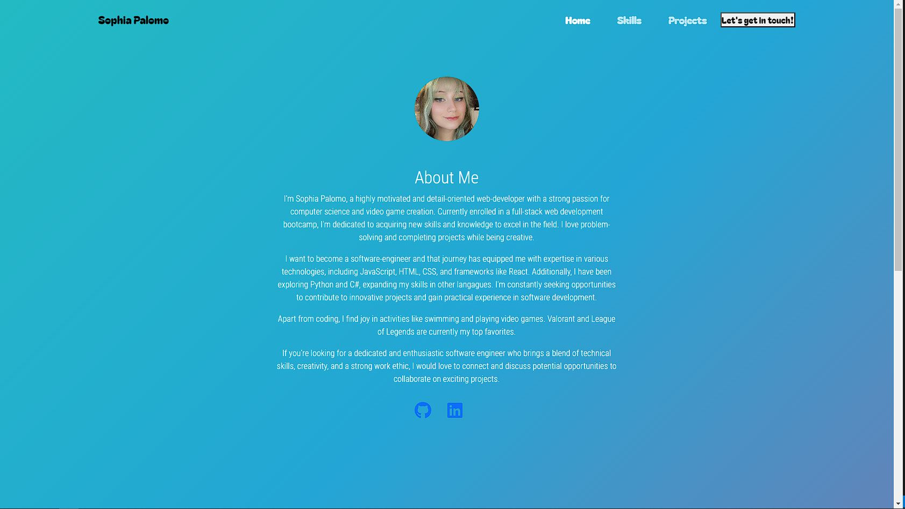
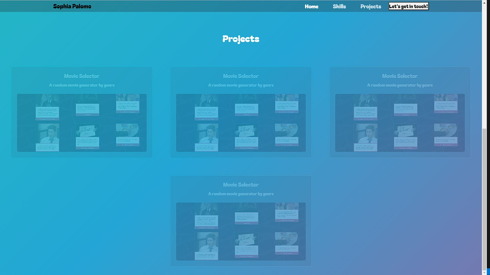

# React-Portolio [](https://opensource.org/licenses/MIT)

  ## Description

  I made this Portfolio using backend and React, as well as node_modules. This project showed me how fun it is to use React as opposed to just plain html and css. I still have alot more I want to be able to do with this portfolio and add alot more animations. Features I would love to implent are light and dark mode, and finshing the contact page and skills.

  ## Table of Contents

  -[Installation](#installation)
  -[Usage](#usage)
  -[Credits](#credits)
  -[License](#license)
  -[Contact](#contact)

  ## Installation

To run this project locally, you need to have npm (Node Package Manager) and React installed. Follow the steps below to get started:

1. Clone this repository to your local machine.
2. Open a terminal and navigate to the project's root directory.
3. Run the following command to install the required dependencies:

   ```shell
   npm install

   ## Usage
  
  

 
In the project section, when you hover over a project it will apear more clearly.

  ## Credits
  
  `https://www.sliderrevolution.com/resources/css-animated-background/` 
  For Gradient Background Animation
  
  ## License
  
  
  This project is licensed under the MIT license. 
  See the [LICENSE](./LICENSE) file for details.

  ## Contact

  Any questions or concerns here is my contact info below.

  -Github: [@TinyTiim](https://github.com/TinyTiim)
  -Email sophia.palomo12@gmail.com;
